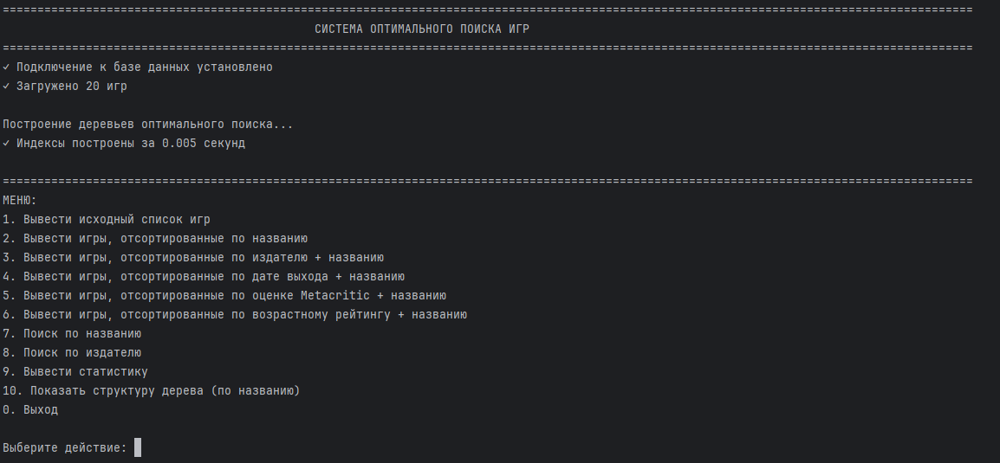
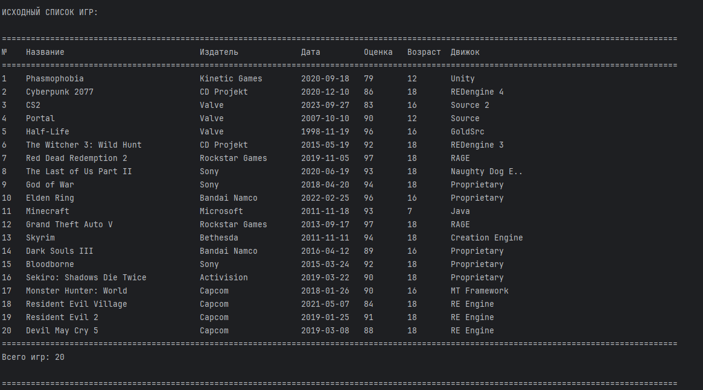
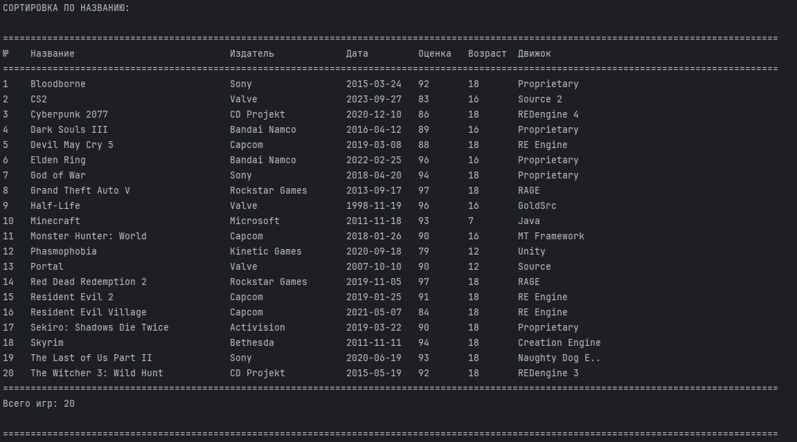
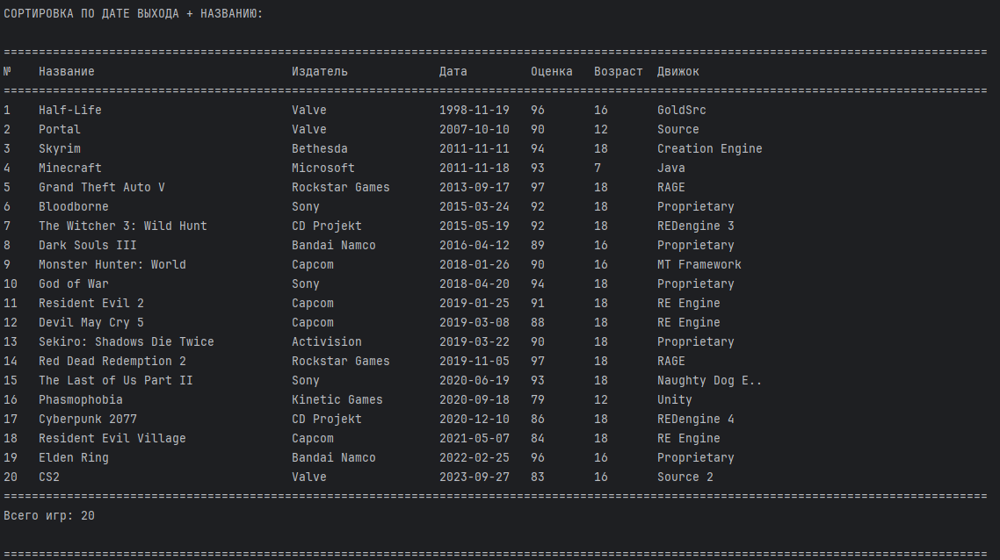

# 🎮 Game Library

**Игровая библиотека** — приложение для поиска, сортировки и управления коллекцией игр


---

## 📥 Установка

### Windows

**Вариант 1: Готовый установщик**
```
1. Скачайте GameLibrary_Setup.exe
2. Запустите и следуйте инструкциям
3. Ярлык появится на рабочем столе
```

**Вариант 2: Вручную**
```bash
# 1. Установите Python 3.8+ и PostgreSQL
# 2. Запустите установщик
python setup.py

# 3. Запустите приложение
run.bat
```

### Linux

```bash
# 1. Установка зависимостей
sudo apt install python3 python3-venv python3-tk postgresql

# 2. Запуск установщика
python3 setup.py

# 3. Запуск приложения
./run.sh
```

📖 **Подробная инструкция:** см. [INSTALL.md](INSTALL.md)

---

## ✨ Возможности

- 📋 **Просмотр игр** — база из 200+ игр
- 🔍 **Поиск** — по названию и издателю
- 🔄 **Сортировка** — 5 вариантов (название, издатель, дата, рейтинг, возраст)
- 📊 **Статистика** — информация о деревьях поиска
- ➕ **Добавление** — добавляйте новые игры
- 🖼️ **Картинки** — обложки из Steam API
- 🌙 **Тёмная тема** — профессиональный дизайн

---

## 📸 Скриншоты






---

## 🗄️ Структура базы данных

### Таблица: games

| Поле | Тип | Описание |
|------|-----|----------|
| id | INT | Уникальный идентификатор |
| title | VARCHAR(100) | Название игры |
| developer | VARCHAR(100) | Разработчик |
| publisher | VARCHAR(100) | Издатель |
| release_date | DATE | Дата выхода |
| metacritic_score | INT | Оценка на Metacritic |
| genre | VARCHAR(100) | Жанр |
| platform | VARCHAR(255) | Платформы |
| game_modes | VARCHAR(100) | Режимы игры |
| engine | VARCHAR(100) | Движок |
| russian_language | BOOLEAN | Русский язык |
| age_rating | INT | Возрастной рейтинг |

---

## 🚀 Быстрый старт

```bash
# Клонирование репозитория
git clone <repository-url>
cd architecture_computer

# Установка
python setup.py

# Запуск
# Windows: run.bat
# Linux: ./run.sh
```

---

## 📋 Требования

| Компонент | Версия |
|-----------|--------|
| Python | 3.8+ |
| PostgreSQL | 12+ |
| RAM | 2 GB |
| Место на диске | 500 MB |

---

## 🛠️ Разработка

```bash
# Создание виртуального окружения
python -m venv venv

# Активация
# Windows: venv\Scripts\activate
# Linux: source venv/bin/activate

# Установка зависимостей
pip install -r requirements.txt

# Запуск
python src/main.py
```

---

## 📁 Структура проекта

```
architecture_computer/
├── src/
│   ├── main.py           # Основное приложение
│   ├── db_manager.py     # Работа с БД
│   ├── game_index.py     # Индексы и поиск
│   └── optimal_tree.py   # Оптимальные деревья
├── database/             # SQL скрипты
├── requirements.txt      # Зависимости Python
├── setup.py             # Установщик
├── run.bat / run.sh     # Скрипты запуска
└── README.md            # Документация
```

---

## 📚 Документация

- [INSTALL.md](INSTALL.md) — подробная установка
- [BUILD.md](BUILD.md) — сборка установщика
- [Дизайн-документ.DOCX](Дизайн-документ.DOCX) — дизайн-документ

---

## 👥 Авторы

- **Демин С.** — Разработка БД и структуры
- **Сергиенко А.** — Разработка приложения

---

## 📝 История версий

### 1.0.0 (2026)
- ✨ Начальный релиз
- 🎨 Профессиональный UI
- 📦 Установщик
- 🔍 Поиск и сортировка
- 📊 Статистика деревьев

---

## 📄 Лицензия

MIT License — см. [LICENSE](LICENSE) файл

---

## 🆘 Поддержка

При возникновении проблем:
1. Проверьте [INSTALL.md](INSTALL.md)
2. Убедитесь, что PostgreSQL запущен
3. Проверьте логи приложения

**Email:** support@example.com  
**Issues:** https://github.com/username/repo/issues

---

<div align="center">

**Game Library** © 2026

</div>
